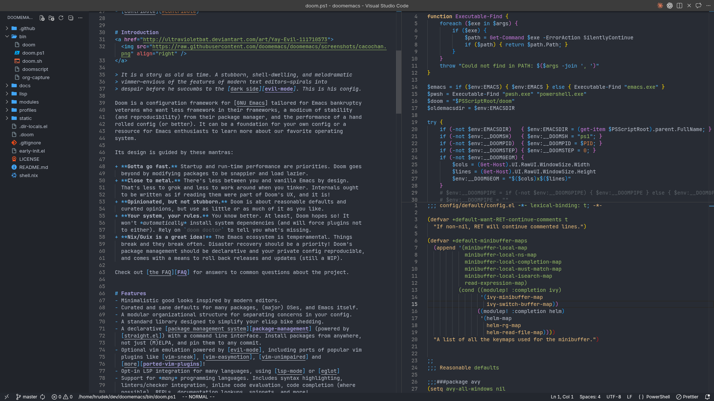
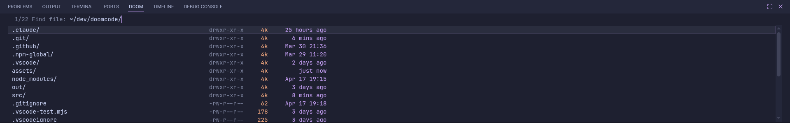
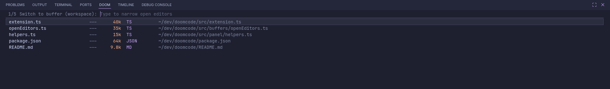
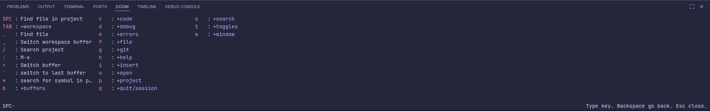

<div align="center">
  <h1>Doom Code – VS Code Extension</h1>
</div>



> **Warning:** This extension is deeply opinionated. It hides the activity bar, disables tabs, overrides keybindings, and restructures VS Code's UI to replicate [Doom Emacs](https://github.com/doomemacs/doomemacs) workflows. If you are unfamiliar with Vim modal editing and Doom Emacs conventions, VS Code will feel broken. Install only if you know what you're getting into — or are ready to learn.

## Table of Contents

- [Introduction](#-introduction)
- [Features](#-features)
- [Modal Editing](#-modal-editing)
- [Requirements](#-requirements)
- [Installation](#-installation)
- [UI Philosophy](#-ui-philosophy)
- [Customization](#%EF%B8%8F-customization)
- [Credits & Inspiration](#-credits--inspiration)
- [Contributing](#-contributing)

Bring the power and elegance of **Doom Emacs** to VS Code. This configuration transforms VS Code into a modal, keyboard-driven editor that closely mirrors Doom Emacs' workflows and philosophy – designed for developers who either want to learn Doom Emacs or are forced to use VS Code but prefer an Emacs-like experience.

> **How it works:** This project is packaged as a **VS Code extension** that builds on top of the excellent **[VSCodeVim](https://github.com/vscodevim/vim)** and **[VSpaceCode](https://github.com/VSpaceCode/vscode-which-key)** extensions, which provide the core modal editing and which-key menu system. The primary contribution of this extension is a **carefully crafted which-key configuration** that extends VSpaceCode's standard bindings and organizes them to closely match **Doom Emacs' command structure and philosophy**. Required dependencies are installed automatically alongside this extension.

## 📖 Introduction

Doom Emacs is known for its efficient keybindings, modal editing, and a clean, distraction-free interface. However, not everyone can use Emacs – whether due to ecosystem constraints, team workflows, or specific tool requirements.

**doomcode** bridges this gap by curating and configuring the existing ecosystem of VS Code extensions:

- **VSCodeVim** provides authentic **evil-mode keybindings** (Vim-like modal editing)
- **VSpaceCode** provides the **which-key menu system** for leader-key navigation
- **This extension** configures these extensions to **recreate Doom Emacs' command structure and workflows**

The result is a **configuration-based adaptation** that brings Doom's philosophy to VS Code developers with minimal friction.

This configuration works best for developers who value **efficiency over mouse usage** and want a **predictable, modal editing experience**.

## ✨ Features

This configuration includes:

- Doom-style leader-key navigation centered around `SPC`, with the live which-key menu as the source of truth for available bindings
- Modal code actions for formatting, references, imports, rename, quick fixes, and refactors through grouped menus instead of scattered shortcuts
- Integrated terminal, debug, AI assistant, and window-management menus exposed through which-key
- Opinionated editor defaults for a cleaner layout, including hidden activity bar, hidden tabs, disabled breadcrumbs, and a hidden command center
- Required companion extensions for modal editing, which-key, and TODO highlighting

### File Navigation

Doom Code ships its own file navigation panels that replace VS Code's built-in Quick Open for common workflows.

**`SPC .` / `SPC f f` — Directory browser**

A Doom-style `find-file` panel that opens in the current file's directory (falling back to project root, then `$HOME`). Navigate directories by typing, use `Tab` to complete the selected item into the path, and backspace past a `/` to jump up a level without reaching for the mouse. Stock VS Code's Quick Open always roots at the workspace and has no directory-aware traversal — this panel lets you navigate the filesystem like you would in Emacs.



**`SPC SPC` / `SPC p f` — Project file picker**

Orderless AND matching: space-separate terms to filter by multiple words in any order, matching files that contain all terms regardless of order. Each result shows the file's last modified time and size alongside the path. Stock Quick Open uses a single fuzzy string and shows no file metadata.

**`SPC ,` — Buffer switcher**

Lists all open editors across tab groups with vim-style dirty/readonly flags, file size, file type badge, and workspace-relative path. Paths under your home directory are shown with `~`. Fuzzy-filters as you type; live-previews the selected buffer without switching focus.



## 🎮 Modal Editing

All keybindings follow **Vim/Evil conventions**:

- `leader` = `Space` (configure via leader key)
- Alternative which-key trigger = `Alt+Space` and `Ctrl+Space` (only where SPC is not working)
- Which-key menus activate automatically with a short delay
- All standard movement keys work in modal contexts



Explorer, Open Editors, Timeline, terminal, and other focused views also get context-aware bindings where VS Code allows them.

## 📋 Requirements

All companion extensions are installed automatically alongside Doom Code.

### Extension Dependencies

Declared as hard dependencies — installed automatically and required for Doom Code to function:

1. **[VSCodeVim](https://github.com/vscodevim/vim)** – Vim/Evil-mode emulation
   - Provides modal editing (normal, insert, visual modes)
   - Handles all Vim motions and operators
2. **[VSpaceCode](https://github.com/VSpaceCode/vscode-which-key)** – Which-key menu system
   - Displays keyboard command menus (like Doom's prefix menu)
   - The entire custom configuration is built on which-key's binding system
   - Standard VS Code command menus have been extended to match Doom Emacs' style as closely as possible

### Extension Pack

Bundled alongside Doom Code and installed automatically, but not hard dependencies:

3. **[Todo Highlight](https://marketplace.visualstudio.com/items?itemName=wayou.vscode-todo-highlight)** – Highlight TODO-style annotations
   - Powers Doom Code's default `TODO:`, `FIXME:`, `NOTE:`, `REVIEW:`, and `HACK:` comment highlighting
   - Adds matching overview ruler markers with Doom Code's color palette
4. **[Magit for VS Code](https://marketplace.visualstudio.com/items?itemName=kahole.magit)** – Git interface modeled on Emacs Magit
   - Provides a keyboard-driven git workflow inside VS Code
   - Doom Code ships keybinding overrides that make it behave more like the original Magit

Project search, in-file fuzzy search, workspace buffer switching, and the custom which-key panels are built into Doom Code.

## 🚀 Installation

### Step 1: Install the Extension

Search for **Doom Code** in the VS Code Extensions marketplace and click Install. VSCodeVim and VSpaceCode are declared as dependencies and will be installed automatically.

### Step 2: Use the Start Page to Opt In

On activation, Doom Code opens a start page with:

- a button to run **Doom Code: Install**
- a button to run **Doom Code: Clean Up Stale Settings**
- repository and issue links
- the current changelog

Doom Code does **not** write to your user settings automatically anymore. It only applies install defaults after you explicitly confirm the install command.

When install runs, Doom Code treats any existing value in these user-owned scopes as yours and leaves it untouched:

- user/global scope
- workspace scope
- workspace-folder scope
- language-specific user/workspace/workspace-folder scopes

If you want to reopen the page later, run **Doom Code: Show Dashboard**.

### Step 3: Configure UI Layout

For the configuration to work optimally:

1. **Open the Explorer panel** (`SPC o p` or from the sidebar)
2. **Drag "Timeline"** from the top to the bottom panel
3. **Drag "Open Editors"** to make it its own tab inside the primary side bar for a cleaner UI

This creates a clean primary editor area with file navigation and history in the bottom panel, matching Doom Emacs' layout philosophy.

If the start page opening on activation becomes noise, set `doom.startPage.openOnActivation` to `false`.

### Step 4: Clean Up Your UI (Recommended)

The configuration assumes a **clean UI**. For best results:

- Hide the Activity bar (already configured)
- Disable tab bars (already configured)
- Breadcrumbs are disabled (already configured)
- Command Center is hidden (already configured)
- Remove unnecessary sidebar icons
- Keep only essential panels visible

A minimal UI reduces distractions and makes keyboard-driven navigation more effective.

## 🎨 UI Philosophy

This configuration emphasizes:

- **Keyboard-first workflow** – Everything centers on leader-key navigation
- **Minimal visual noise** – Hidden tabs, breadcrumbs, and command center
- **Modal paradigm** – Use Vim modes instead of mouse-based selection
- **Consistent keybindings** – Doom Emacs conventions throughout

The cleaner your UI, the more effective the modal experience becomes.

## ⚙️ Customization

The main customization happens through **which-key bindings** in the VS Code settings. You can customize bindings by editing `whichkey.bindings` in your user `settings.json`, or by forking this extension and editing the `contributes.configurationDefaults` section of its `package.json`. Edit the `whichkey.bindings` array to:

- Add new leader-key shortcuts
- Modify existing bindings
- Create nested command groups


### Overriding bindings without editing the full list

Use `whichkey.bindingOverrides` to surgically add or remove bindings without touching the full `whichkey.bindings` array. Keys are dot-separated paths into the menu tree.

**Remove a binding** (`position: -1`):

```json
"whichkey.bindingOverrides": [
  {
    "keys": "q.l",
    "position": -1 
  }
]
```

**Add a binding** (omit `position` to append, or set a number to insert at that index). If a binding with the same key already exists at that path, it is replaced:

```json
"whichkey.bindingOverrides": [
  {
    "keys": "q.a",
    "name": "Go to line",
    "type": "command",
    "command": "workbench.action.gotoLine"
  }
]
```

> **Note:** The doom which-key UI only supports adding and removing bindings via `bindingOverrides`. The `when` condition feature from VSpaceCode does not work here — conditional overrides are silently ignored.

Refer to the [VSpaceCode documentation](https://github.com/VSpaceCode/vscode-which-key) for advanced configuration options.

## 🙏 Credits & Inspiration

This configuration stands on the shoulders of amazing projects:

- **[Doom Emacs](https://github.com/doomemacs/doomemacs)** – The philosophical foundation and keybinding inspiration that makes this configuration possible
- **[VSCodeVim](https://github.com/vscodevim/vim)** – Bringing authentic Vim/Evil modal editing to VS Code
- **[VSpaceCode](https://github.com/VSpaceCode/vscode-which-key)** – The which-key implementation that enables Doom-like leader-key menus

Thank you to all contributors and maintainers of these projects for their dedication to improving the developer experience.

## 📄 License

MIT License – Feel free to use, modify, and share this extension.

## 💡 Tips

- Press `SPC` once to see available commands in which-key
- Use `SPC h b` to search the full which-key binding list
- Use `SPC :` for the VS Code command palette
- Customize the theme and icon theme to match your own preferences

## 🤝 Contributing

Found improvements or better keybindings? Contributions are welcome!

**For users:** Feel free to submit issues and pull requests to enhance the doomcode experience.

**For developers:** Want to contribute code? See [CONTRIBUTING.md](CONTRIBUTING.md) for setup instructions, build commands, and development workflow.

---

**Make VS Code feel like Doom Emacs. Happy coding!** 🚀
